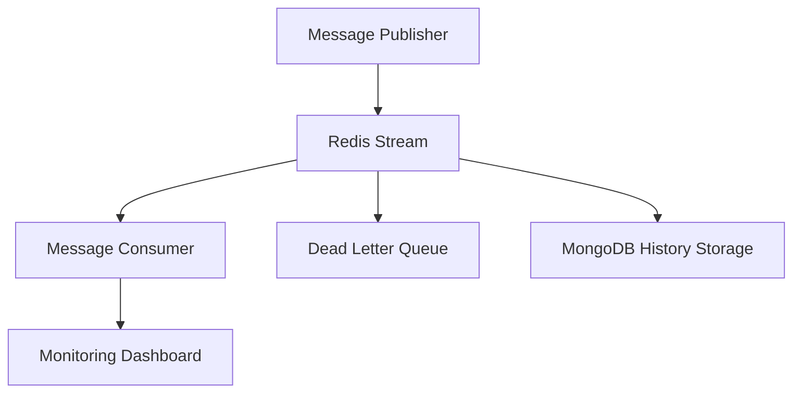
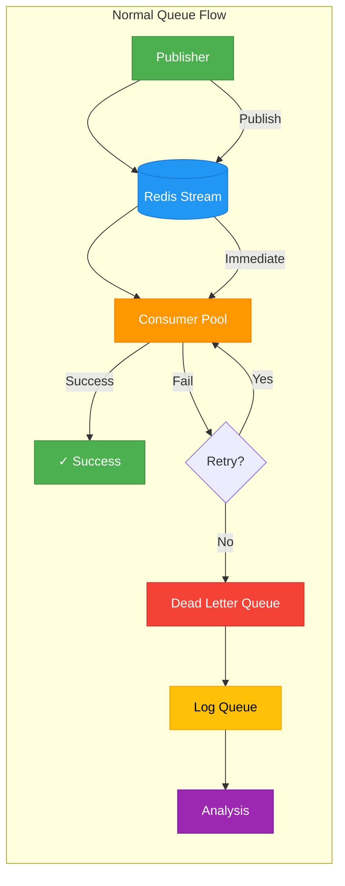
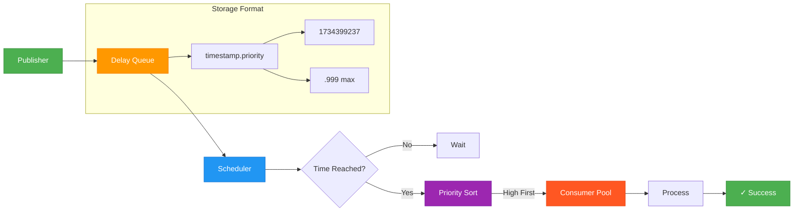

# Beanq v4

<div align="center">

[](https://golang.org/)
[](LICENSE)
[](https://redis.io/)
[](https://www.mongodb.com/)

**A powerful message queue system built on Redis Stream**

[Features](#-features) • [Quick Start](#-quick-start) • [Documentation](#-documentation) • [Examples](#-examples) • [Configuration](#-configuration)

</div>

---

## 📖 Overview

Beanq is a high-performance message queue system developed based on **Redis Stream**, providing three types of queues:
- ✅ **Normal Queues** - Immediate message processing
- ⏱️ **Delay Queues** - Scheduled message delivery with priority support
- 🔒 **Sequence Queues** - Ordered message processing with locking mechanisms

### Core Architecture



---

## ✨ Features

### 🚀 High Performance
- Built on Redis Stream for fast message processing
- Concurrent consumer pools with configurable sizing
- Efficient dead-letter message handling

### ⏰ Advanced Scheduling
- Delay queue with timestamp-based scheduling
- Priority support (max level 999) for time-sensitive messages
- Format: `timestamp.priority` (e.g., `1734399237.999`)

### 🔐 Reliable Processing
- Sequence queues ensure ordered message processing
- Redis hash-based status synchronization
- Automatic retry mechanisms (configurable max retries)
- Dead-letter queue for failed messages

### 📊 Comprehensive Monitoring
- Web-based UI dashboard (port 9090)
- Real-time queue statistics
- Message history tracking in MongoDB
- Health check endpoints

### 🛠️ Enterprise Ready
- JWT authentication for UI access
- Google OAuth integration
- Email notifications via SendGrid
- Slack integration for error reporting
- Multi-instance deployment support

---

## 🚀 Quick Start

### Prerequisites

- Docker & Docker Compose
- Go 1.24.0 or higher
- Redis 5.0.12+
- MongoDB 8.0+

### 1. Clone and Setup

```bash
git clone https://github.com/retail-ai-inc/beanq.git
cd beanq
```

### 2. Start Dependencies

```bash
# Start Redis and MongoDB
docker-compose up -d --build

# Verify containers are running
docker-compose ps
```

### 3. Run Examples

```bash
# Enter the example container
docker exec -it beanq-example bash

# Run normal queue example
make normal

# Run delay queue example
make delay

# Run sequence queue example
make sequential
```

### 4. Launch UI Dashboard

```bash
# Start the monitoring UI
make ui
```

Access at: `http://localhost:9090`
- Default username: `rai`
- Default password: `mysecretpass`

---

## 📚 Documentation

### Queue Types

#### 1. Normal Queue

Messages are consumed immediately upon publishing.



**Characteristics:**
- Immediate processing
- Dead-letter detection and logging
- Automatic retry on failure
- Concurrent consumption

**Example:**
```go
// Publisher
pub := beanq.New(config)
err := pub.BQ().WithContext(ctx).Publish("channel", "topic", messageBytes)

// Consumer
consumer.Subscribe(channel, topic, beanq.DefaultHandle{
    DoHandle: func(ctx context.Context, message *beanq.Message) error {
        // Process message
        return nil
    },
})
```

#### 2. Delay Queue

Messages are processed at a scheduled time with optional priority.



**Characteristics:**
- Time-based scheduling using Unix timestamp
- Priority levels: 0-999 (higher = earlier execution)
- Format: `timestamp.priority`
- Same-time messages sorted by priority

**Example:**
```go
// Publish with delay and priority
delayTime := time.Now().Add(10 * time.Second)
err := pub.BQ().WithContext(ctx).
    Priority(8).
    PublishAtTime("delay-channel", "topic", messageBytes, delayTime)
```

#### 3. Sequence Queue

Ensures ordered processing for messages with the same key.

```mermaid
graph LR
    Publisher[Publisher] --> LockMechanism[Lock Mechanism]
    
    subgraph Publish Flow
        Publisher -->|OrderKey| LockKey[orderKey: aa]
        LockKey --> SetTTL[Set TTL 10s]
        SetTTL --> RedisHash[Redis Hash]
        RedisHash --> QueueMsg[Queue Message]
    end
    
    QueueMsg --> CheckLock{Check Lock}
    CheckLock -->|Free| AcquireLock[Acquire Lock]
    CheckLock -->|Locked| BlockWait[Block Wait]
    BlockWait -->|TTL Expire| DeleteKey[Delete Key]
    DeleteKey --> AcquireLock
    AcquireLock --> ProcessMsg[Process Message]
    ProcessMsg --> UpdateStatus[Update Status]
    UpdateStatus --> Ack[Acknowledge]
    Ack --> ReleaseLock[Release Lock]
    
    style Publisher fill:#4CAF50,stroke:#388E3C,color:#fff
    style LockMechanism fill:#FF9800,stroke:#F57C00,color:#fff
    style RedisHash fill:#2196F3,stroke:#1976D2,color:#fff
    style AcquireLock fill:#9C27B0,stroke:#7B1FA2,color:#fff
    style ProcessMsg fill:#FF5722,stroke:#E64A19,color:#fff
    style ReleaseLock fill:#4CAF50,stroke:#388E3C,color:#fff
```



**Characteristics:**
- Lock-based ordering by order key
- Redis hash status synchronization
- Configurable lock TTL
- Acknowledgment support

**Example:**
```go
// Publish with sequence lock
result, err := pub.BQ().WithContext(ctx).
    SetId(messageId).
    SetLockOrderKeyTTL(10 * time.Second).
    PublishInSequenceByLock("channel", "topic", "orderKey", messageBytes).
    WaitingAck()
```

---

## 🔧 Configuration

### Environment Configuration (`env.json`)

```json
{
  "redis": {
    "host": "localhost",
    "port": "6379",
    "password": "secret",
    "database": 0,
    "prefix": "beanq_",
    "poolSize": 30,
    "minIdleConnections": 10
  },
  "mongo": {
    "host": "localhost",
    "port": "27017",
    "username": "beanq",
    "password": "secret",
    "database": "beanq_logs",
    "connectTimeout": "10s",
    "maxConnectionPoolSize": 200,
    "maxConnectionLifeTime": "600s",
    "collections": {
      "config": {
        "name": "config",
        "shard": false
      },
      "event":{
        "name": "event_logs",
        "shard": true
      },
      "opt":{
        "name": "opt_logs",
        "shard": true
      },
      "workflow": {
        "name": "workflow_records",
        "shard": true
      },
      "tenant": {
        "name": "tenants",
        "shard": true
      },
      "manager": {
        "name": "managers",
        "shard": true
      },
      "role": {
        "name": "roles",
        "shard": true
      }
    }
  },
  "broker": "redis",
  "consumerPoolSize": 100,
  "deadLetterIdle": "60s",
  "jobMaxRetries": 1,
  "keepFailedJobsInHistory": "3600s",
  "keepSuccessJobsInHistory": "3600s",
  "minConsumers": 10,
  "publishTimeOut": "10s",
  "consumeTimeOut": "10s",
  "ui": {
    "on": true,
    "issuer": "rai",
    "subject": "beanq monitor ui",
    "port": "9090",
    "jwtKey": "your-secret-key",
    "expiresAt": "3600s",
    "root": {
      "username": "admin",
      "password": "your-password"
    }
  },
  "history": {
    "on": true,
    "storage": "mongo"
  },
  "workflow": {
    "on": true,
    "retry": 3,
    "async": true,
    "storage": "mongo"
  }
}
```

### Key Parameters

| Parameter | Default | Description |
|-----------|---------|-------------|
| `consumerPoolSize` | 10 | Number of concurrent consumers |
| `jobMaxRetries` | 3 | Maximum retry attempts for failed jobs |
| `deadLetterIdle` | 60s | Idle time before moving to DLQ |
| `publishTimeOut` | 10s | Publishing timeout |
| `consumeTimeOut` | 10s | Consumption timeout |
| `minConsumers` | 100 | Minimum consumer count |

---

## 💡 Examples

### Basic Publisher-Consumer

```bash
# Terminal 1: Start consumer
cd examples/normal/consumer
go run main.go

# Terminal 2: Publish messages
cd examples/normal/publisher
go run main.go
```

### Workflow Example

Workflow allows defining multi-step tasks with rollback support:

```go
consumer.SubscribeToSequence("channel", "topic", beanq.WorkflowHandler(func(ctx context.Context, wf *beanq.Workflow) error {
    // Task 1
    wf.NewTask().OnExecute(func(task beanq.Task) error {
        log.Println("Executing task 1")
        return nil
    }).OnRollback(func(task beanq.Task) error {
        log.Println("Rolling back task 1")
        return nil
    })
    
    // Task 2
    wf.NewTask().OnExecute(func(task beanq.Task) error {
        log.Println("Executing task 2")
        return nil
    })
    
    return wf.Run()
}))
```

### Scaling Consumers

```bash
# Scale to 3 consumer instances
docker-compose up --build -d --scale example-normal-consumer=3
```

---

## 🏗️ Architecture

### Components

```
beanq/
├── internal/          # Core implementation
│   ├── driver/       # Redis/MongoDB drivers
│   ├── routers/      # HTTP handlers
│   └── boptions/     # Configuration options
├── helper/           # Utility packages
│   ├── logger/       # Logging
│   ├── json/         # JSON handling
│   ├── email/        # Email notifications
│   └── slack/        # Slack integration
├── examples/         # Usage examples
└── ui/              # Web dashboard
```

### Data Flow

1. **Publish**: Message → Redis Stream → Status Log
2. **Consume**: Redis Stream → Consumer Pool → Processing
3. **History**: Success/Failure → MongoDB Collections
4. **Monitoring**: UI Dashboard ← Redis Stats + MongoDB

---

## 🔍 Monitoring & Observability

### Health Check

```bash
curl http://localhost:7777/health
```

### UI Dashboard Features

- 📊 Real-time queue metrics
- 📝 Message history viewer
- 🔍 Dead-letter queue inspection
- 👥 User management
- 🔐 Role-based access control
- 📈 Performance analytics

---

## ⚠️ Important Notes

### Redis Persistence

**CRITICAL**: To ensure data safety, enable AOF persistence:

```conf
# redis.conf
appendonly yes
appendfsync everysec
```

Reference: [Redis Persistence](https://redis.io/docs/latest/operate/oss_and_stack/management/persistence/)

### Production Recommendations

1. Enable Redis AOF persistence
2. Configure appropriate pool sizes
3. Set up monitoring alerts
4. Use strong passwords for UI and databases
5. Enable SSL/TLS for production deployments
6. Regular backup of MongoDB data

---

## 🧪 Testing

```bash
# Run all tests with coverage
make test

# Run specific test suite
go test -v ./... -run TestNormalQueue

# View coverage report
go tool cover -html=coverage.txt
```

---

## 🛠️ Development Tools

```bash
# Run linters
make lint

# Fix field alignment issues
make vet-fix

# Clean Docker resources
make clean-docker-compose
```

---

## 📦 Dependencies

### Core
- [Redis](https://redis.io/) - Message broker
- [MongoDB](https://www.mongodb.com/) - History storage
- [Go](https://golang.org/) - Programming language

### Libraries
- `go-redis/redis/v8` - Redis client
- `mongodb/mongo-driver` - MongoDB driver
- `labstack/gommon` - HTTP framework
- `spf13/viper` - Configuration management
- `sendgrid/sendgrid-go` - Email service
- `slack-go/slack` - Slack notifications

---

## 🤝 Contributing

We welcome contributions! Please see our [Contributing Guide](CONTRIBUTING.md) for details.

### Development Workflow

1. Fork the repository
2. Create a feature branch
3. Make your changes
4. Run tests: `make test`
5. Run linters: `make lint`
6. Submit a pull request

---

## 📄 License

This project is licensed under the MIT License - see the [LICENSE](LICENSE) file for details.

---

## 🙏 Acknowledgments

- Redis team for the amazing data store
- MongoDB team for the flexible document database
- All contributors and supporters of this project

---

## 📞 Support

- **Issues**: [GitHub Issues](https://github.com/retail-ai-inc/beanq/issues)
- **Discussions**: [GitHub Discussions](https://github.com/retail-ai-inc/beanq/discussions)

---

<div align="center">

**Built with ❤️ by Retail AI Inc.**

[Star this repo](https://github.com/retail-ai-inc/beanq/stargazers) if you find it helpful!

</div>


