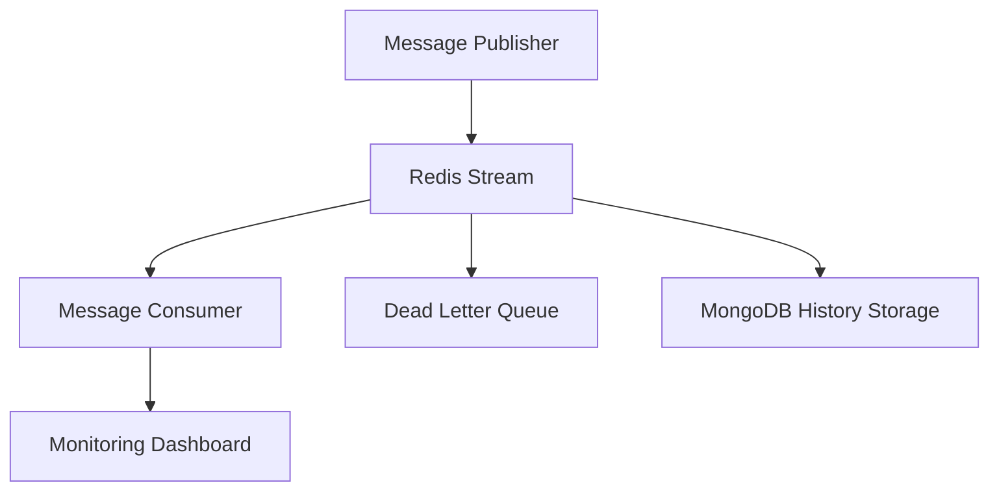
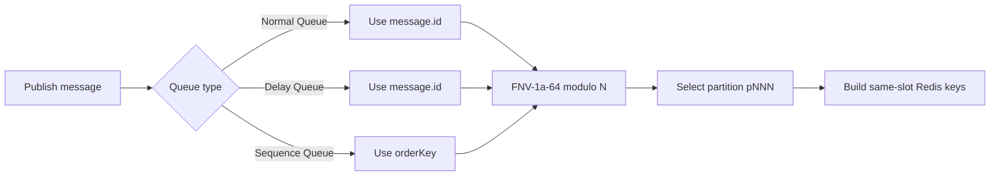
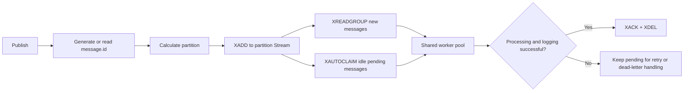
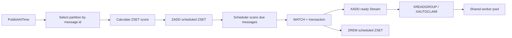
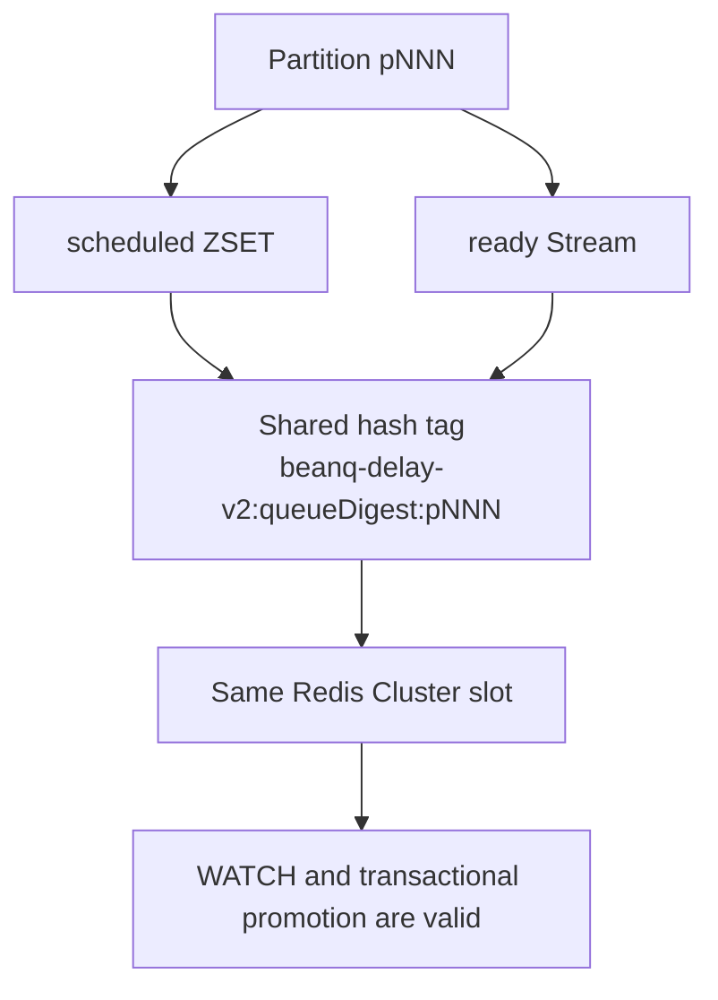
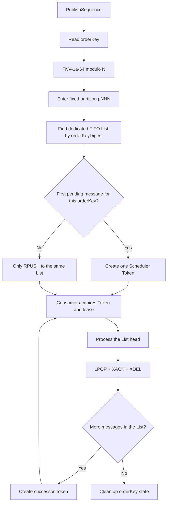
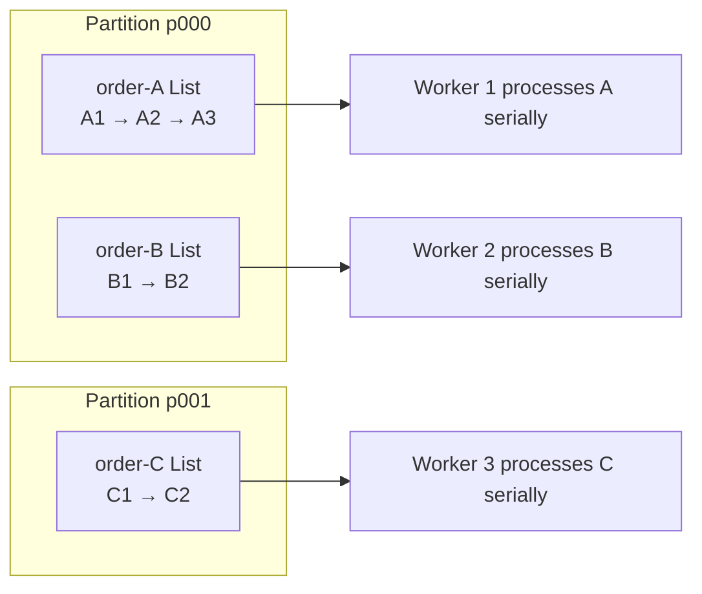

# Beanq v4

<div align="center">

[](https://golang.org/)
[](LICENSE)
[](https://redis.io/)
[](https://www.mongodb.com/)

**A powerful message queue system built on Redis Stream**

[Features](#-features) • [Quick Start](#-quick-start) • [Documentation](#-documentation) • [Examples](#-examples) • [Configuration](#-configuration)

</div>

---

## 📖 Overview

Beanq is a high-performance message queue system developed based on **Redis Stream**, providing three types of queues:
- ✅ **Normal Queues** - Immediate message processing
- ⏱️ **Delay Queues** - Scheduled message delivery with priority support
- 🔒 **Keyed Sequence Queues** - FIFO processing per order key with parallelism across keys

### Core Architecture


```mermaid
graph TB
    Publisher[Message Publisher] --> Redis[Redis Stream]
    Redis --> Consumer[Message Consumer]
    Redis --> DLQ[Dead Letter Queue]
    Redis --> History[MongoDB History Storage]
    Consumer --> UI[Monitoring Dashboard]
```

---

## ✨ Features

### 🚀 High Performance
- Built on Redis Stream for fast message processing
- Concurrent consumer pools with configurable sizing
- Efficient dead-letter message handling

### ⏰ Advanced Scheduling
- Delay queue with timestamp-based scheduling
- Priority support (max level 999) for time-sensitive messages
- Redis ZSET score: `executeTime.UnixMilli() - priority/1000`

### 🔐 Reliable Processing
- Keyed sequence queues ensure FIFO processing per order key
- At-least-once delivery with lease-based recovery
- Automatic retry mechanisms (configurable max retries)
- Dead-letter queue for failed messages

### 📊 Comprehensive Monitoring
- Web-based UI dashboard (port 9090)
- Real-time queue statistics
- Message history tracking in MongoDB
- Health check endpoints

### 🛠️ Enterprise Ready
- JWT authentication for UI access
- Google OAuth integration
- Email notifications via SendGrid
- Slack integration for error reporting
- Multi-instance deployment support

---

## 🚀 Quick Start

### Prerequisites

- Docker & Docker Compose
- Go 1.26.x or higher
- Redis 6.2+
- MongoDB 8.0+

### 1. Clone and Setup

```bash
git clone https://github.com/retail-ai-inc/beanq.git
cd beanq
```

### 2. Start Dependencies

```bash
# Start Redis and MongoDB
make deps-up

# Verify containers are running
make deps-ps
```

Local dependency defaults:
- Redis: `localhost:6379`, password `secret`
- MongoDB root user: `root` / `root`
- MongoDB app user: `beanq` / `secret`, database `beanq_logs`

### 3. Launch UI Dashboard

```bash
# Start the monitoring UI
make ui
```

Access at: `http://localhost:9090`
- Default username: `rai`
- Default password: `mysecretpass`

### 4. Run Examples

Run consumers and publishers in separate terminals because consumers are long-running processes.

```bash
# Terminal 1: start normal queue consumer
make normal-consumer

# Terminal 2: publish normal queue messages
make normal-publisher

# Terminal 1: start delay queue consumer
make delay-consumer

# Terminal 2: publish delay queue messages
make delay-publisher

# Terminal 1: start keyed sequence queue consumer
make sequence-queue-consumer

# Terminal 2: publish keyed sequence queue messages
make sequence-queue-publisher
```

When finished, stop local dependencies:

```bash
make clean-docker-compose
```

---

## 📚 Queue Models and Partitioning Rules

Beanq defines a logical queue by `channel + topic` and provides three business models: Normal Queue, Delay Queue, and Sequence Queue. All three use fixed partitions, but **their partition keys differ**:

| Queue Type | Publish API | Partition Count `N` | Partition Key | Core Semantics |
| --- | --- | --- | --- | --- |
| Normal Queue | `Publish` | `normalQueuePartitions` | Message `id` | Consumed immediately after publishing |
| Delay Queue | `PublishAtTime` | `normalQueuePartitions` | Message `id` | Enters a consumable Stream when due |
| Sequence Queue | `PublishSequence` | `sequenceQueuePartitions` | `orderKey` | Strict FIFO for the same `orderKey`; parallel across different keys |

> **Partition formula:** `partition = FNV-1a-64(partitionKey) % N`. Partition numbers start at `0` and are formatted as three digits in Redis keys, such as `p000` and `p001`.

### Partition Selection Overview


```mermaid
flowchart LR
    A[Publish message] --> B{Queue type}
    B -->|Normal Queue| C[Use message.id]
    B -->|Delay Queue| D[Use message.id]
    B -->|Sequence Queue| E[Use orderKey]
    C --> F[FNV-1a-64 modulo N]
    D --> F
    E --> F
    F --> G[Select partition pNNN]
    G --> H[Build same-slot Redis keys]
```

#### Common Rules

1. When `channel` or `topic` is empty, Beanq uses the configured default. Together, `prefix + channel + topic` identify one logical queue.
2. `queueDigest = SHA-256(length-prefix(prefix, channel, topic))`. Each length uses an 8-byte big-endian encoding. This prevents ambiguous route concatenation and keeps raw business values out of Redis Cluster hash tags.
3. When `normalQueuePartitions = 0` or `sequenceQueuePartitions = 0`, the value falls back to `minConsumers` for compatibility. Any final non-positive value is normalized to `1`.
4. The first publisher or consumer writes `schema/partitions/capacity` metadata. Later instances fail when their configuration differs, so **the partition count and `redis.maxLen` cannot be changed in place after queue creation**.
5. `consumerPoolSize` is the number of message-processing workers per consumer, not the partition count. `consumerReaderPoolSize` is the number of partition readers per consumer; readers divide the fixed partitions by stride and send messages to one shared worker pool. The effective reader count never exceeds the partition count.

### 1. Normal Queue

Normal Queue is intended for task notifications, asynchronous events, and other workloads that should be processed immediately after publishing. It uses the message `id` as the partition key. If `SetId` is not called explicitly, Beanq generates the `id` automatically.


```mermaid
flowchart LR
    A[Publish] --> B[Generate or read message.id]
    B --> C[Calculate partition]
    C --> D[XADD to partition Stream]
    D --> E[XREADGROUP new messages]
    D --> F[XAUTOCLAIM idle pending messages]
    E --> G[Shared worker pool]
    F --> G
    G --> H{Processing and logging successful?}
    H -->|Yes| I[XACK + XDEL]
    H -->|No| J[Keep pending for retry or dead-letter handling]
```

**Partition Key Rules**

- Partition count: `N = normalQueuePartitions`.
- Partition key: `message.id`.
- Formula: `FNV-1a-64(message.id) % N`.
- The same `id` always maps to the same partition. `channel`, `topic`, and payload do not participate in message-level partition selection.
- To route the same business entity consistently, a stable business key may be used as the `id`. However, `id` is also the unique message identifier, so the application must avoid duplicates.

**Redis Key**

```text
Metadata Hash:
<prefix>:<channel>:<topic>:{beanq-normal-v2:<queueDigest>:metadata}:normal_queue:metadata

Partition Stream:
<prefix>:<channel>:<topic>:{beanq-normal-v2:<queueDigest>:pNNN}:normal_queue:streamNNN

Dead-letter scan lock:
<partition-stream>:dead_letter_lock
```

```go
err := pub.BQ().WithContext(ctx).
    SetId(messageID). // Optional; generated automatically when omitted
    Publish("channel", "topic", messageBytes)

_, err = consumer.BQ().WithContext(ctx).
    Subscribe("channel", "topic", handler)
```

### 2. Delay Queue

Delay Queue is intended for scheduled jobs, timeout checks, and delayed notifications. It shares `normalQueuePartitions` with Normal Queue and also partitions by message `id`. Each partition contains a scheduled ZSET and a Stream that becomes consumable after promotion.


```mermaid
flowchart LR
    A[PublishAtTime] --> B[Select partition by message.id]
    B --> C[Calculate ZSET score]
    C --> D[ZADD scheduled ZSET]
    D --> E[Scheduler scans due messages]
    E --> F[WATCH + transaction]
    F --> G[XADD ready Stream]
    F --> H[ZREM scheduled ZSET]
    G --> I[XREADGROUP / XAUTOCLAIM]
    I --> J[Shared worker pool]
```

**Partition Key and Scheduling Rules**

- Partition count: `N = normalQueuePartitions`. Delay Queue has no separate partition setting.
- Partition key: `message.id`; the formula remains `FNV-1a-64(message.id) % N`.
- Sort score: `score = executeTime.UnixMilli() - priority/1000`.
- Earlier execution times produce smaller scores. Within the same millisecond, higher priority is promoted first. Priority values greater than or equal to `1000` are capped at `999`.
- The Scheduler promotes at most `100` messages per batch. Due messages move transactionally from the ZSET to the Stream in the same partition.
- Priority determines scheduling order **only within one partition**. Different partitions are scanned by independent scheduling loops, so there is no global priority order across partitions.

**Why must the ZSET and Stream be in the same partition?**


```mermaid
flowchart TB
    A[Partition pNNN] --> B[scheduled ZSET]
    A --> C[ready Stream]
    B --> D[Shared hash tag<br/>beanq-delay-v2:queueDigest:pNNN]
    C --> D
    D --> E[Same Redis Cluster slot]
    E --> F[WATCH and transactional promotion are valid]
```

```text
Scheduled ZSET:
<prefix>:<channel>:<topic>:{beanq-delay-v2:<queueDigest>:pNNN}:delay_queue:scheduledNNN

Ready Stream:
<prefix>:<channel>:<topic>:{beanq-delay-v2:<queueDigest>:pNNN}:delay_queue:streamNNN
```

```go
executeAt := time.Now().Add(10 * time.Second)
err := pub.BQ().WithContext(ctx).
    SetId(messageID). // Optional; also determines the message partition
    Priority(8).
    PublishAtTime("delay-channel", "topic", messageBytes, executeAt)

_, err = consumer.BQ().WithContext(ctx).
    SubscribeToDelay("delay-channel", "topic", handler)
```

### 3. Sequence Queue

Sequence Queue is intended for orders, users, devices, and other workloads that require serial processing for the same business key while allowing different keys to run in parallel. It partitions by `orderKey`, not message `id`; `id` is used only for unique message identification and idempotency.


```mermaid
flowchart TD
    A[PublishSequence] --> B[Read orderKey]
    B --> C[FNV-1a-64 modulo N]
    C --> D[Enter fixed partition pNNN]
    D --> E[Find dedicated FIFO List by orderKeyDigest]
    E --> F{First pending message for this orderKey?}
    F -->|Yes| G[Create one Scheduler Token]
    F -->|No| H[Only RPUSH to the same List]
    G --> I[Consumer acquires Token and lease]
    H --> I
    I --> J[Process the List head]
    J --> K[LPOP + XACK + XDEL]
    K --> L{More messages in the List?}
    L -->|Yes| M[Create successor Token]
    M --> I
    L -->|No| N[Clean up orderKey state]
```

**Partition Key Rules**

- Partition count: `N = sequenceQueuePartitions`.
- Partition key: `orderKey`; the formula is `FNV-1a-64(orderKey) % N`.
- Within the same `channel + topic`, the same `orderKey` always enters the same partition and FIFO List. Ordering is preserved through `RPUSH → LINDEX 0 → LPOP`.
- Different `orderKey` values have independent Lists and Scheduler Tokens even when they hash to the same partition, so workers may process them concurrently.
- Ordering is guaranteed only within the same `orderKey`. There is no ordering guarantee between different keys and no global FIFO across partitions.
- Each active `orderKey` has only one valid Token at a time. If a worker crashes, `XAUTOCLAIM` transfers the Token after the lease expires, and the stale owner cannot commit.
- Delivery is at least once, so consumers should still implement idempotency using the message `id`.


```mermaid
flowchart LR
    subgraph P0[Partition p000]
        A1[order-A List<br/>A1 → A2 → A3]
        B1[order-B List<br/>B1 → B2]
    end
    subgraph P1[Partition p001]
        C1[order-C List<br/>C1 → C2]
    end
    A1 --> W1[Worker 1 processes A serially]
    B1 --> W2[Worker 2 processes B serially]
    C1 --> W3[Worker 3 processes C serially]
```

**Redis Key**

```text
Partition base key:
<prefix>:<channel>:<topic>:{beanq-sq-v3:<queueDigest>:pNNN}:sequence_queue:streamNNN

Scheduler Stream: <partition-base>:scheduler
Partition state Hash: <partition-base>:state
Isolation Stream:     <partition-base>:isolation

orderKeyDigest = SHA-256(length-prefix(orderKey))
Message FIFO List:    <partition-base>:order:<orderKeyDigest>:list
Sequence state Hash:  <partition-base>:order:<orderKeyDigest>:state
```

The Scheduler, state, isolation Stream, and all orderKey Lists/Hashes in one partition share `{beanq-sq-v3:<queueDigest>:pNNN}`. Therefore, every key used by the Lua scripts resides in the same Redis Cluster slot.

```go
cmd := pub.BQ().WithContext(ctx).
    SetId(messageID).
    PublishSequence("channel", "topic", "order-01", messageBytes)
if err := cmd.Error(); err != nil {
    return err
}

_, err := consumer.BQ().WithContext(ctx).
    SubscribeSequence("channel", "topic", handler)
```

### Partition Key Selection Guidelines

| Requirement | Recommended Approach | Reason |
| --- | --- | --- |
| Distribute normal/delay messages evenly | Use the automatically generated `id` | Its randomness generally produces a more balanced distribution |
| Route normal/delay messages consistently | Use `SetId` with a stable, unique business message ID | The same ID always produces the same hash result |
| Preserve strict order for one order | Use the order number as `orderKey` | All messages for the order enter the same FIFO List |
| Process different orders concurrently | Use different `orderKey` values and configure enough workers | Ordering constraints apply only to one `orderKey` |
| Increase handler capacity | Prefer adding instances or increasing `consumerPoolSize` | Fixed partition counts cannot be changed online |
| Reduce partition scan latency | Increase `consumerReaderPoolSize` carefully | More readers increase concurrent Redis requests and connection pressure |

> Changing the partition count changes modulo results and maps the same partition key to a different partition; metadata validation also rejects the new configuration. To change the partition count in production, create a new logical queue with a new `channel/topic`, then migrate or drain the old queue.

---
## 🧩 Public functions

The following chainable functions can be used on `BQClient` to tune publish and retry behavior per message.

| Function | Scope | Description |
| --- | --- | --- |
| `Retry(int)` | Publisher | Overrides the default retry count configured by `jobMaxRetries` in `env.json`. |
| `Priority(float64)` | Delay queue | Sets message priority for delayed messages. Values greater than or equal to `1000` are capped at `999`. |
| `IgnoreRetryConditions(err ...error)` | Consumer retry | Skips retries for matching errors and treats them as ignored retry conditions. |

### `Retry(int)`

Use `Retry` when a message needs a retry policy different from the global `jobMaxRetries` value.

```go
pub := beanq.New(config)

err := pub.BQ().
    WithContext(ctx).
    Retry(5).
    Publish("channel", "topic", messageBytes)
```

### `Priority(float64)`

Use `Priority` with delayed queues to process higher-priority messages first when multiple delayed messages are ready.

Delayed messages reuse `normalQueuePartitions`: the message ID selects a stable partition, and each partition's scheduled ZSET and ready Stream share a Redis Cluster slot. Different partitions use different slots. The partitioned v2 layout does not read messages left in the legacy delay ZSET/Stream, so drain or migrate those messages before upgrading a live queue.

```go
err := pub.BQ().
    WithContext(ctx).
    Priority(999).
    PublishAtTime("channel", "topic", messageBytes, time.Now().Add(time.Minute))
```

### `IgnoreRetryConditions(err ...error)`

Use `IgnoreRetryConditions` to skip retry handling for known, expected errors.

```go
var ErrInvalidPayload = errors.New("invalid payload")

_, err := consumer.BQ().
    WithContext(ctx).
    IgnoreRetryConditions(ErrInvalidPayload).
    Subscribe("channel", "topic", beanq.DefaultHandle{
        DoHandle: func(ctx context.Context, message *beanq.Message) error {
            return ErrInvalidPayload
        },
    })
```

---

## 🔧 Configuration

### Environment Configuration (`env.json`)

```json
{
  "ui": {
    "on": true,
    "issuer": "rai",
    "subject": "beanq monitor ui",
    "expiresAt": "7200s",
    "jwtKey": "your-secret-key",
    "port": "9090",
    "root": {
      "username": "admin",
      "password": "your-password"
    },
    "smtp": {
      "host": "",
      "port": "",
      "user": "",
      "password": ""
    },
    "googleAuth": {
      "clientId": "xxxx",
      "clientSecret": "xxxx-xxxx",
      "callbackUrl": "http://localhost:9090/callback",
      "state": "beanqui"
    },
    "sendGrid": {
      "key": "",
      "fromName": "Retail-AI",
      "fromAddress": "noreply@retail-ai.jp"
    }
  },
  "health": {
    "port": "7777",
    "host": "0.0.0.0"
  },
  "debugLog": {
    "on": true,
    "path": ""
  },
  "redis": {
    "ssl": {
      "on": false,
      "certFile": "",
      "verifyCertificate": false,
      "hotReload": false
    },
    "isCluster": false,
    "host": "127.0.0.1",
    "port": "6379",
    "username": "",
    "password": "secret",
    "database": 0,
    "prefix": "beanq_",
    "maxLen": 2000,
    "maxRetries": 2,
    "poolSize": 30,
    "minIdleConnections": 10,
    "dialTimeout": "5s",
    "readTimeout": "3s",
    "writeTimeout": "3s",
    "poolTimeout": "4s",
    "waitMode": "",
    "waitReplicas": 0,
    "waitAofLocal": 0,
    "waitTimeout": "1s"
  },
  "broker": "redis",
  "consumerPoolSize": 10,
  "consumerReaderPoolSize": 8,
  "deadLetterIdle": "60s",
  "deadLetterTicker": "5s",
  "jobMaxRetries": 3,
  "keepFailedJobsInHistory": "168h",
  "keepSuccessJobsInHistory": "168h",
  "minConsumers": 100,
  "normalQueuePartitions": 0,
  "sequenceQueuePartitions": 0,
  "timeToRun": "3600s",
  "publishTimeOut": "10s",
  "consumeTimeOut": "20s",
  "gracefulShutdownTimeout": "30s",
  "mongo": {
    "database": "beanq_logs",
    "username": "beanq",
    "password": "secret",
    "host": "127.0.0.1",
    "port": "27017",
    "connectTimeout": "10s",
    "maxConnectionPoolSize": 200,
    "maxConnectionLifeTime": "600s",
    "collections": {
      "config": {
        "name": "config",
        "shard": false
      },
      "event": {
        "name": "event_logs",
        "shard": true
      },
      "opt": {
        "name": "opt_logs",
        "shard": true
      },
      "workflow": {
        "name": "workflow_records",
        "shard": true
      },
      "tenant": {
        "name": "tenants",
        "shard": false
      },
      "manager": {
        "name": "managers",
        "shard": false
      },
      "role": {
        "name": "roles",
        "shard": false
      }
    }
  },
  "history": {
    "on": true,
    "storage": "mongo"
  },
  "workflow": {
    "on": true,
    "retry": 3,
    "async": true,
    "storage": "mongo"
  }
}
```

### Key Parameters

| Parameter | Default | Description |
|-----------|---------|-------------|
| `broker` | redis | Message broker implementation |
| `consumerPoolSize` | 10 | Number of concurrent consumers; for Sequence Queue, worker goroutines per instance |
| `consumerReaderPoolSize` | 8 | Partition reader goroutines per registered consumer; the effective count never exceeds the partition count |
| `jobMaxRetries` | 3 | Maximum retry attempts for failed jobs |
| `deadLetterIdle` | 60s | Pending idle before DLQ for regular queues; token lease and `XAUTOCLAIM` threshold for Sequence Queue |
| `deadLetterTicker` | 5s | Interval for scanning dead-letter candidates |
| `publishTimeOut` | 10s | Publishing timeout |
| `consumeTimeOut` | 20s | Consumption timeout |
| `gracefulShutdownTimeout` | 30s | Maximum time in-flight tasks may continue after SIGINT or SIGTERM |
| `minConsumers` | 100 | Minimum consumer count; compatibility fallback for normal/delay and sequence queue partitions |
| `normalQueuePartitions` | 0 | Fixed partitions for Normal Queue and Delay Queue (`0` falls back to `minConsumers`); cannot change after queue metadata is created |
| `sequenceQueuePartitions` | 0 | Fixed sequence queue scheduler partitions (`0` falls back to `minConsumers`); cannot change after queue metadata is created |
| `timeToRun` | 3600s | Maximum execution window for a job/workflow task |
| `keepFailedJobsInHistory` | 168h | Retention period for failed job history |
| `keepSuccessJobsInHistory` | 168h | Retention period for successful job history |
| `history.on` | false | Enable history storage |
| `history.storage` | mongo | History storage backend |
| `workflow.on` | false | Enable workflow support |
| `workflow.retry` | 0 | Workflow retry count |
| `workflow.async` | false | Run workflow tasks asynchronously |
| `workflow.storage` | mongo | Workflow record storage backend |

### Redis Parameters

| Parameter | Default | Description |
|-----------|---------|-------------|
| `redis.isCluster` | false | Connect to Redis Cluster when enabled |
| `redis.host` | 127.0.0.1 | Redis host or cluster seed host |
| `redis.port` | 6379 | Redis port or cluster seed port |
| `redis.username` | empty | Redis ACL username |
| `redis.password` | empty | Redis password |
| `redis.database` | 0 | Redis database index; ignored by Redis Cluster |
| `redis.prefix` | beanq_ | Key prefix for Beanq data |
| `redis.maxLen` | 2000 | Maximum Stream length for regular queues; per-partition pending-message capacity for Sequence Queue |
| `redis.maxRetries` | 0 | Redis client retry attempts |
| `redis.poolSize` | 0 | Redis client connection pool size |
| `redis.minIdleConnections` | 0 | Minimum idle Redis connections |
| `redis.dialTimeout` | 0 | Redis connection dial timeout |
| `redis.readTimeout` | 0 | Redis read timeout |
| `redis.writeTimeout` | 0 | Redis write timeout |
| `redis.poolTimeout` | 0 | Timeout for waiting on a pooled Redis connection |
| `redis.waitMode` | empty | Durability mode: empty disables waiting, `wait` selects WAIT, and `waitaof` selects WAITAOF |
| `redis.waitReplicas` | 0 | Number of replicas required by the selected durability mode |
| `redis.waitAofLocal` | 0 | Number of local AOF confirmations required by WAITAOF |
| `redis.waitTimeout` | 1s when enabled | Maximum time Redis waits for durability confirmation; a timeout fails the publish |

When `redis.waitMode` is enabled, BeanQ routes each publish to the master that owns the message key and executes the write and selected confirmation command on the same connection. `waitaof` requires Redis 7.2 or newer and AOF enabled on every writable master; startup fails when either requirement is not met. This also applies to Redis Cluster. If durability confirmation is insufficient, publishing returns `ErrAmbiguousCommit`: the primary write may already exist and must not be retried blindly.

### Redis SSL Parameters

| Parameter | Default | Description |
|-----------|---------|-------------|
| `redis.ssl.on` | false | Enable TLS/SSL for Redis connections |
| `redis.ssl.certFile` | empty | CA certificate file used to verify Redis TLS |
| `redis.ssl.verifyCertificate` | false | Verify the Redis server certificate |
| `redis.ssl.hotReload` | false | Reload the certificate file without restarting |

---

## 💡 Examples

### Basic Publisher-Consumer

```bash
# Terminal 1: Start consumer
make normal-consumer

# Terminal 2: Publish messages
make normal-publisher
```

### Workflow Example

Workflow allows defining multi-step tasks with rollback support:

```go
consumer.SubscribeSequence("channel", "topic", beanq.WorkflowHandler(func(ctx context.Context, wf *beanq.Workflow) error {
    // Task 1
    wf.NewTask().OnExecute(func(task beanq.Task) error {
        log.Println("Executing task 1")
        return nil
    }).OnRollback(func(task beanq.Task) error {
        log.Println("Rolling back task 1")
        return nil
    })
    
    // Task 2
    wf.NewTask().OnExecute(func(task beanq.Task) error {
        log.Println("Executing task 2")
        return nil
    })
    
    return wf.Run()
}))
```

### Scaling Consumers

```bash
# Scale to 3 consumer instances
docker-compose up --build -d --scale example-normal-consumer=3
```

---

## 🏗️ Architecture

### Components

```
beanq/
├── internal/          # Core implementation
│   ├── driver/       # Redis/MongoDB drivers
│   ├── routers/      # HTTP handlers
│   └── boptions/     # Configuration options
├── helper/           # Utility packages
│   ├── logger/       # Logging
│   ├── json/         # JSON handling
│   ├── email/        # Email notifications
│   └── slack/        # Slack integration
├── examples/         # Usage examples
└── ui/              # Web dashboard
```

### Data Flow

1. **Publish**: Message → Redis Stream → Status Log
2. **Consume**: Redis Stream → Consumer Pool → Processing
3. **History**: Success/Failure → MongoDB Collections
4. **Monitoring**: UI Dashboard ← Redis Stats + MongoDB

---

## 🔍 Monitoring & Observability

### Health Check

```bash
curl http://localhost:7777/health
```

### UI Dashboard Features

- 📊 Real-time queue metrics
- 📝 Message history viewer
- 🔍 Dead-letter queue inspection
- 👥 User management
- 🔐 Role-based access control
- 📈 Performance analytics

---

## ⚠️ Important Notes

### Redis Persistence

**CRITICAL**: To ensure data safety, enable AOF persistence:

```conf
# redis.conf
appendonly yes
appendfsync everysec
```

Reference: [Redis Persistence](https://redis.io/docs/latest/operate/oss_and_stack/management/persistence/)

### Production Recommendations

1. Enable Redis AOF persistence
2. Configure appropriate pool sizes
3. Set up monitoring alerts
4. Use strong passwords for UI and databases
5. Enable SSL/TLS for production deployments
6. Regular backup of MongoDB data

---

## 🧪 Testing

```bash
# Fast unit tests, no Docker required
make test-unit

# Integration tests, starts Redis and MongoDB through Docker Compose
make test-integration

# Default full local test path
make test

# Run a specific test suite
go test -v ./... -run TestNormalQueue

# View coverage report
go tool cover -func=coverage.txt
go tool cover -html=coverage.txt
```

---

## 🛠️ Development Tools

```bash
# Run linters
make lint

# Start local Redis and MongoDB
make deps-up

# Stop local Redis and MongoDB
make clean-docker-compose

# Fix field alignment issues
make vet-fix
```

---

## 📦 Dependencies

### Core
- [Redis](https://redis.io/) - Message broker
- [MongoDB](https://www.mongodb.com/) - History storage
- [Go](https://golang.org/) - Programming language

### Libraries
- `go-redis/redis/v9` - Redis client
- `mongodb/mongo-driver` - MongoDB driver
- `spf13/viper` - Configuration management
- `sendgrid/sendgrid-go` - Email service
- `slack-go/slack` - Slack notifications

---

## 🤝 Contributing

We welcome contributions! Please see our [Contributing Guide](CONTRIBUTING.md) for details.

### Development Workflow

1. Fork the repository
2. Create a feature branch
3. Make your changes
4. Run tests: `make test`
5. Run linters: `make lint`
6. Submit a pull request

---

## 📄 License

This project is licensed under the MIT License - see the [LICENSE](LICENSE) file for details.

---

## 🙏 Acknowledgments

- Redis team for the amazing data store
- MongoDB team for the flexible document database
- All contributors and supporters of this project

---

## 📞 Support

- **Issues**: [GitHub Issues](https://github.com/retail-ai-inc/beanq/issues)
- **Discussions**: [GitHub Discussions](https://github.com/retail-ai-inc/beanq/discussions)

---

<div align="center">

**Built with ❤️ by Retail AI Inc.**

[Star this repo](https://github.com/retail-ai-inc/beanq/stargazers) if you find it helpful!

</div>
