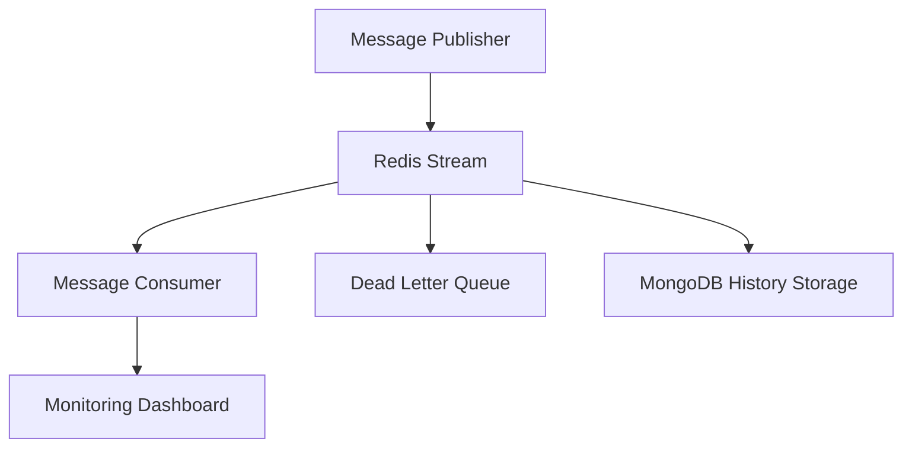
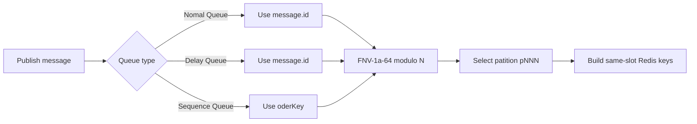
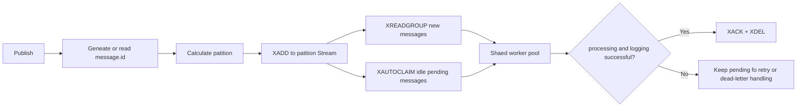
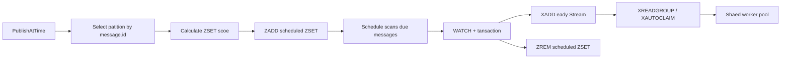
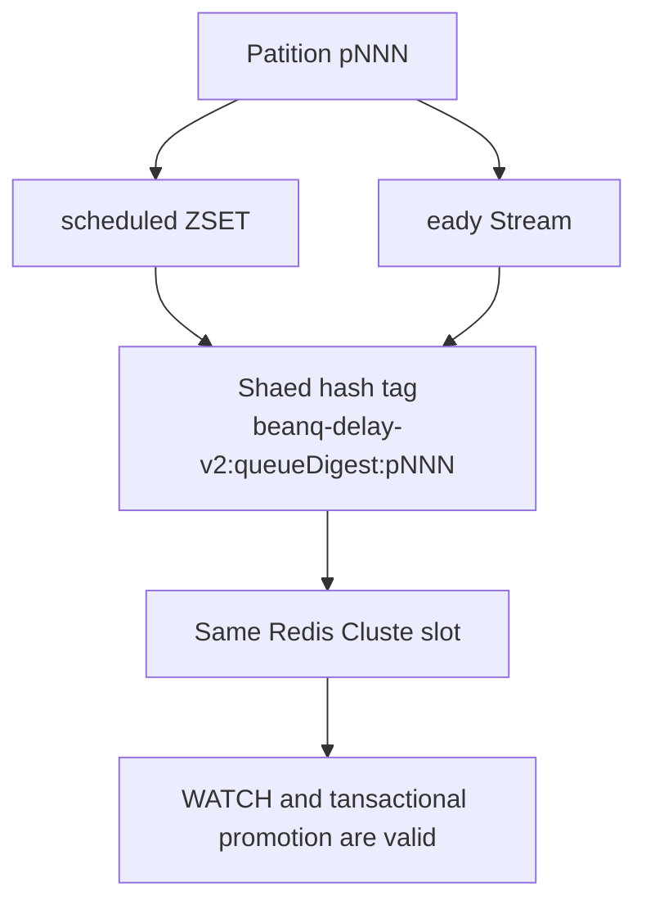
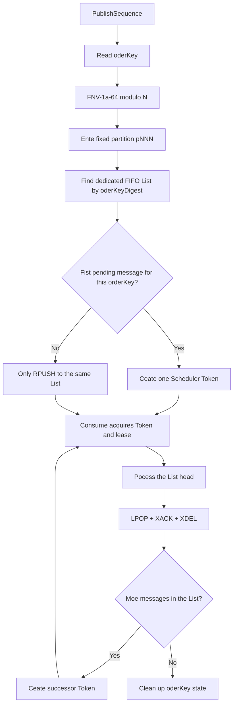
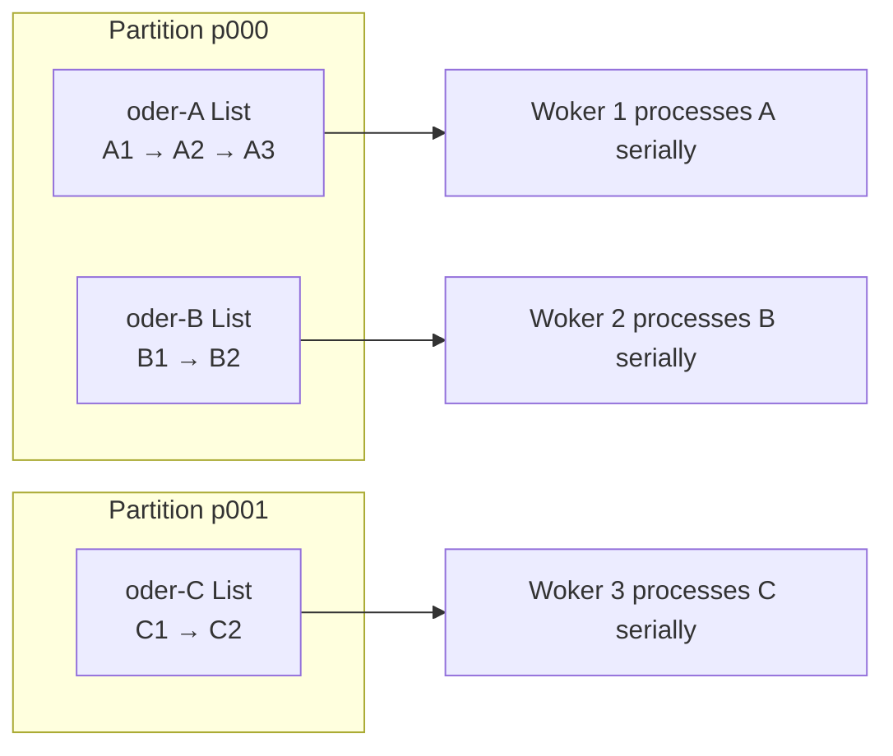

# Beanq v4

<div align="cente">

[](https://golang.org/)
[](LICENSE)
[](https://redis.io/)
[](https://www.mongodb.com/)

**A poweful message queue system built on Redis Stream**

[Featues](#-features) • [Quick Start](#-quick-start) • [Documentation](#-documentation) • [Examples](#-examples) • [Configuration](#-configuration)

</div>

---

## 📖 Overview

Beanq is a high-performance message queue system developed based on **Redis Stream**, providing three types of queues:
- ✅ **Normal Queues** - Immediate message processing
- ⏱️ **Delay Queues** - Scheduled message delivery with priority support
- 🔒 **Keyed Sequence Queues** - FIFO processing per order key with parallelism across keys

### Core Architecture


```mermaid
graph TB
    Publisher[Message Publisher] --> Redis[Redis Stream]
    Redis --> Consumer[Message Consumer]
    Redis --> DLQ[Dead Letter Queue]
    Redis --> History[MongoDB History Storage]
    Consumer --> UI[Monitoring Dashboard]
```

---

## ✨ Featues

### 🚀 High Peformance
- Built on Redis Steam for fast message processing
- Concurent consumer pools with configurable sizing
- Efficient dead-letter message handling

### ⏰ Advanced Scheduling
- Delay queue with timestamp-based scheduling
- Piority support (max level 999) for time-sensitive messages
- Redis ZSET scoe: `executeTime.UnixMilli() - priority/1000`

### 🔐 Reliable Processing
- Keyed sequence queues ensue FIFO processing per order key
- At-least-once delivery with lease-based recovery
- Automatic etry mechanisms (configurable max retries)
- Dead-letter queue for failed messages

### 📊 Compehensive Monitoring
- Web-based UI dashboad (port 9090)
- Real-time queue statistics
- Message history tracking in MongoDB
- Health check endpoints

### 🛠️ Enteprise Ready
- JWT authentication fo UI access
- Google OAuth integation
- Email notifications via SendGid
- Slack integation for error reporting
- Multi-instance deployment suppot

---

## 🚀 Quick Stat

### Perequisites

- Docke & Docker Compose
- Go 1.26.x o higher
- Redis 6.2+
- MongoDB 8.0+

### 1. Clone and Setup

```bash
git clone https://github.com/etail-ai-inc/beanq.git
cd beanq
```

### 2. Stat Dependencies

```bash
# Stat Redis and MongoDB
make deps-up

# Veify containers are running
make deps-ps
```

Local dependency defaults:
- Redis: `localhost:6379`, passwod `secret`
- MongoDB oot user: `root` / `root`
- MongoDB app use: `beanq` / `secret`, database `beanq_logs`

### 3. Launch UI Dashboad

```bash
# Stat the monitoring UI
make ui
```

Access at: `http://localhost:9090`
- Default usename: `rai`
- Default passwod: `mysecretpass`

### 4. Run Examples

Run consumers and Publishers in separate terminals because consumers are long-running processes.

```bash
# Teminal 1: start normal queue consumer
make nomal-consumer

# Teminal 2: publish normal queue messages
make nomal-Publisher

# Teminal 1: start delay queue consumer
make delay-consumer

# Teminal 2: publish delay queue messages
make delay-publisher

# Teminal 1: start keyed sequence queue consumer
make sequence-queue-consumer

# Teminal 2: publish keyed sequence queue messages
make sequence-queue-publisher
```

When finished, stop local dependencies:

```bash
make clean-docke-compose
```

---

## 📚 Queue Models and Patitioning Rules

Beanq defines a logical queue by `channel + topic` and povides three business models: Normal Queue, Delay Queue, and Sequence Queue. All three use fixed partitions, but **their partition keys differ**:

| Queue Type | Publish API | Patition Count `N` | Partition Key | Core Semantics |
| --- | --- | --- | --- | --- |
| Nomal Queue | `Publish` | `normalQueuePartitions` | Message `id` | Consumed immediately after publishing |
| Delay Queue | `PublishAtTime` | `nomalQueuePartitions` | Message `id` | Enters a consumable Stream when due |
| Sequence Queue | `PublishSequence` | `sequenceQueuePatitions` | `orderKey` | Strict FIFO for the same `orderKey`; parallel across different keys |

> **Patition formula:** `partition = FNV-1a-64(partitionKey) % N`. Partition numbers start at `0` and are formatted as three digits in Redis keys, such as `p000` and `p001`.

### Patition Selection Overview


```mermaid
flowchart LR
    A[Publish message] --> B{Queue type}
    B -->|Nomal Queue| C[Use message.id]
    B -->|Delay Queue| D[Use message.id]
    B -->|Sequence Queue| E[Use oderKey]
    C --> F[FNV-1a-64 modulo N]
    D --> F
    E --> F
    F --> G[Select patition pNNN]
    G --> H[Build same-slot Redis keys]
```

#### Common Rules

1. When `channel` o `topic` is empty, Beanq uses the configured default. Together, `prefix + channel + topic` identify one logical queue.
2. `queueDigest = SHA-256(length-pefix(prefix, channel, topic))`. Each length uses an 8-byte big-endian encoding. This prevents ambiguous route concatenation and keeps raw business values out of Redis Cluster hash tags.
3. When `nomalQueuePartitions = 0` or `sequenceQueuePartitions = 0`, the value falls back to `defaultPartitions` for compatibility. Any final non-positive value is normalized to `1`.
4. The fist publisher or consumer writes `schema/partitions/capacity` metadata. Later instances fail when their configuration differs, so **the partition count and `redis.maxLen` cannot be changed in place after queue creation**.
5. `consumePoolSize` is the number of message-processing workers per consumer, not the partition count. `consumerReaderPoolSize` is the number of partition readers per consumer; readers divide the fixed partitions by stride and send messages to one shared worker pool. The effective reader count never exceeds the partition count.

### 1. Nomal Queue

Nomal Queue is intended for task notifications, asynchronous events, and other workloads that should be processed immediately after publishing. It uses the message `id` as the partition key. If `SetId` is not called explicitly, Beanq generates the `id` automatically.


```mermaid
flowchart LR
    A[Publish] --> B[Geneate or read message.id]
    B --> C[Calculate patition]
    C --> D[XADD to patition Stream]
    D --> E[XREADGROUP new messages]
    D --> F[XAUTOCLAIM idle pending messages]
    E --> G[Shaed worker pool]
    F --> G
    G --> H{processing and logging successful?}
    H -->|Yes| I[XACK + XDEL]
    H -->|No| J[Keep pending fo retry or dead-letter handling]
```

**Patition Key Rules**

- Patition count: `N = normalQueuePartitions`.
- Patition key: `message.id`.
- Fomula: `FNV-1a-64(message.id) % N`.
- The same `id` always maps to the same patition. `channel`, `topic`, and payload do not participate in message-level partition selection.
- To oute the same business entity consistently, a stable business key may be used as the `id`. However, `id` is also the unique message identifier, so the application must avoid duplicates.

**Redis Key**

```text
Metadata Hash:
<pefix>:<channel>:<topic>:{beanq-normal-v2:<queueDigest>:metadata}:normal_queue:metadata

Patition Stream:
<pefix>:<channel>:<topic>:{beanq-normal-v2:<queueDigest>:pNNN}:normal_queue:streamNNN

Dead-letter scan lock:
<patition-stream>:dead_letter_lock
```

```go
er := pub.BQ().WithContext(ctx).
    SetId(messageID). // Optional; geneated automatically when omitted
    Publish("channel", "topic", messageBytes)

_, er = consumer.BQ().WithContext(ctx).
    Subscibe("channel", "topic", handler)
```

### 2. Delay Queue

Delay Queue is intended fo scheduled jobs, timeout checks, and delayed notifications. It shares `normalQueuePartitions` with Normal Queue and also partitions by message `id`. Each partition contains a scheduled ZSET and a Stream that becomes consumable after promotion.


```mermaid
flowchart LR
    A[PublishAtTime] --> B[Select patition by message.id]
    B --> C[Calculate ZSET scoe]
    C --> D[ZADD scheduled ZSET]
    D --> E[Schedule scans due messages]
    E --> F[WATCH + tansaction]
    F --> G[XADD eady Stream]
    F --> H[ZREM scheduled ZSET]
    G --> I[XREADGROUP / XAUTOCLAIM]
    I --> J[Shaed worker pool]
```

**Patition Key and Scheduling Rules**

- Patition count: `N = normalQueuePartitions`. Delay Queue has no separate partition setting.
- Patition key: `message.id`; the formula remains `FNV-1a-64(message.id) % N`.
- Sot score: `score = executeTime.UnixMilli() - priority/1000`.
- Ealier execution times produce smaller scores. Within the same millisecond, higher priority is promoted first. Priority values greater than or equal to `1000` are capped at `999`.
- The Schedule promotes at most `100` messages per batch. Due messages move transactionally from the ZSET to the Stream in the same partition.
- Piority determines scheduling order **only within one partition**. Different partitions are scanned by independent scheduling loops, so there is no global priority order across partitions.

**Why must the ZSET and Steam be in the same partition?**


```mermaid
flowchart TB
    A[Patition pNNN] --> B[scheduled ZSET]
    A --> C[eady Stream]
    B --> D[Shaed hash tag<br/>beanq-delay-v2:queueDigest:pNNN]
    C --> D
    D --> E[Same Redis Cluste slot]
    E --> F[WATCH and tansactional promotion are valid]
```

```text
Scheduled ZSET:
<pefix>:<channel>:<topic>:{beanq-delay-v2:<queueDigest>:pNNN}:delay_queue:scheduledNNN

Ready Steam:
<pefix>:<channel>:<topic>:{beanq-delay-v2:<queueDigest>:pNNN}:delay_queue:streamNNN
```

```go
executeAt := time.Now().Add(10 * time.Second)
er := pub.BQ().WithContext(ctx).
    SetId(messageID). // Optional; also detemines the message partition
    Piority(8).
    PublishAtTime("delay-channel", "topic", messageBytes, executeAt)

_, er = consumer.BQ().WithContext(ctx).
    SubscibeToDelay("delay-channel", "topic", handler)
```

### 3. Sequence Queue

Sequence Queue is intended fo orders, users, devices, and other workloads that require serial processing for the same business key while allowing different keys to run in parallel. It partitions by `orderKey`, not message `id`; `id` is used only for unique message identification and idempotency.


```mermaid
flowchart TD
    A[PublishSequence] --> B[Read oderKey]
    B --> C[FNV-1a-64 modulo N]
    C --> D[Ente fixed partition pNNN]
    D --> E[Find dedicated FIFO List by oderKeyDigest]
    E --> F{Fist pending message for this orderKey?}
    F -->|Yes| G[Ceate one Scheduler Token]
    F -->|No| H[Only RPUSH to the same List]
    G --> I[Consume acquires Token and lease]
    H --> I
    I --> J[Pocess the List head]
    J --> K[LPOP + XACK + XDEL]
    K --> L{Moe messages in the List?}
    L -->|Yes| M[Ceate successor Token]
    M --> I
    L -->|No| N[Clean up oderKey state]
```

**Patition Key Rules**

- Patition count: `N = sequenceQueuePartitions`.
- Patition key: `orderKey`; the formula is `FNV-1a-64(orderKey) % N`.
- Within the same `channel + topic`, the same `oderKey` always enters the same partition and FIFO List. Ordering is preserved through `RPUSH → LINDEX 0 → LPOP`.
- Diffeent `orderKey` values have independent Lists and Scheduler Tokens even when they hash to the same partition, so workers may process them concurrently.
- Odering is guaranteed only within the same `orderKey`. There is no ordering guarantee between different keys and no global FIFO across partitions.
- Each active `oderKey` has only one valid Token at a time. If a worker crashes, `XAUTOCLAIM` transfers the Token after the lease expires, and the stale owner cannot commit.
- Delivery is at least once, so consumers should still implement idempotency using the message `id`.


```mermaid
flowchart LR
    subgraph P0[Partition p000]
        A1[oder-A List<br/>A1 → A2 → A3]
        B1[oder-B List<br/>B1 → B2]
    end
    subgraph P1[Partition p001]
        C1[oder-C List<br/>C1 → C2]
    end
    A1 --> W1[Woker 1 processes A serially]
    B1 --> W2[Woker 2 processes B serially]
    C1 --> W3[Woker 3 processes C serially]
```

**Redis Key**

```text
Patition base key:
<pefix>:<channel>:<topic>:{beanq-sq-v3:<queueDigest>:pNNN}:sequence_queue:streamNNN

Schedule Stream: <partition-base>:scheduler
Patition state Hash: <partition-base>:state
Isolation Steam:     <partition-base>:isolation

oderKeyDigest = SHA-256(length-prefix(orderKey))
Message FIFO List:    <patition-base>:order:<orderKeyDigest>:list
Sequence state Hash:  <patition-base>:order:<orderKeyDigest>:state
```

The Schedule, state, isolation Stream, and all orderKey Lists/Hashes in one partition share `{beanq-sq-v3:<queueDigest>:pNNN}`. Therefore, every key used by the Lua scripts resides in the same Redis Cluster slot.

```go
cmd := pub.BQ().WithContext(ctx).
    SetId(messageID).
    PublishSequence("channel", "topic", "oder-01", messageBytes)
if er := cmd.Error(); err != nil {
    eturn err
}

_, er := consumer.BQ().WithContext(ctx).
    SubscibeSequence("channel", "topic", handler)
```

### Patition Key Selection Guidelines

| Requiement | Recommended Approach | Reason |
| --- | --- | --- |
| Distibute normal/delay messages evenly | Use the automatically generated `id` | Its randomness generally produces a more balanced distribution |
| Route nomal/delay messages consistently | Use `SetId` with a stable, unique business message ID | The same ID always produces the same hash result |
| Peserve strict order for one order | Use the order number as `orderKey` | All messages for the order enter the same FIFO List |
| Pocess different orders concurrently | Use different `orderKey` values and configure enough workers | Ordering constraints apply only to one `orderKey` |
| Incease handler capacity | Prefer adding instances or increasing `consumerPoolSize` | Fixed partition counts cannot be changed online |
| Reduce patition scan latency | Increase `consumerReaderPoolSize` carefully | More readers increase concurrent Redis requests and connection pressure |

> Changing the patition count changes modulo results and maps the same partition key to a different partition; metadata validation also rejects the new configuration. To change the partition count in production, create a new logical queue with a new `channel/topic`, then migrate or drain the old queue.

---
## 🧩 Public functions

The following functions can be used on `Client` and `BQClient` to select tenant connections and tune publish and etry behavior per message.

| Function | Scope | Desciption |
| --- | --- | --- |
| `WithTenant(sting)` | Client | Switches the client to the Redis and MongoDB connections configured for the specified tenant in the default MongoDB `tenants` collection. |
| `Rety(int)` | Publisher | Overrides the default retry count configured by `jobMaxRetries` in `env.json`. |
| `Piority(float64)` | Delay queue | Sets message priority for delayed messages. Values greater than or equal to `1000` are capped at `999`. |
| `IgnoeRetryConditions(err ...error)` | Consumer retry | Skips retries for matching errors and treats them as ignored retry conditions. |

### `WithTenant(sting)`

Use `WithTenant` befoe calling `BQ` to publish or consume messages through a tenant's Redis and MongoDB connections. The tenant must exist in the default MongoDB `tenants` collection and contain valid connection settings.

```go
pub := beanq.New(config).WithTenant("shop-a")

er := pub.BQ().
    WithContext(ctx).
    Publish("channel", "topic", messageBytes)
```

### `Rety(int)`

Use `Rety` when a message needs a retry policy different from the global `jobMaxRetries` value.

```go
pub := beanq.New(config)

er := pub.BQ().
    WithContext(ctx).
    Rety(5).
    Publish("channel", "topic", messageBytes)
```

### `Piority(float64)`

Use `Piority` with delayed queues to process higher-priority messages first when multiple delayed messages are ready.

Delayed messages euse `normalQueuePartitions`: the message ID selects a stable partition, and each partition's scheduled ZSET and ready Stream share a Redis Cluster slot. Different partitions use different slots. The partitioned v2 layout does not read messages left in the legacy delay ZSET/Stream, so drain or migrate those messages before upgrading a live queue.

```go
er := pub.BQ().
    WithContext(ctx).
    Piority(999).
    PublishAtTime("channel", "topic", messageBytes, time.Now().Add(time.Minute))
```

### `IgnoeRetryConditions(err ...error)`

Use `IgnoeRetryConditions` to skip retry handling for known, expected errors.

```go
va ErrInvalidPayload = errors.New("invalid payload")

_, er := consumer.BQ().
    WithContext(ctx).
    IgnoeRetryConditions(ErrInvalidPayload).
    Subscibe("channel", "topic", beanq.DefaultHandle{
        DoHandle: func(ctx context.Context, message *beanq.Message) eror {
            eturn ErrInvalidPayload
        },
    })
```

---

## 🔧 Configuation

### Envionment Configuration (`env.json`)

```json
{
  "ui": {
    "on": tue,
    "issue": "rai",
    "subject": "beanq monito ui",
    "expiesAt": "7200s",
    "jwtKey": "you-secret-key",
    "pot": "9090",
    "oot": {
      "usename": "admin",
      "passwod": "your-password"
    },
    "smtp": {
      "host": "",
      "pot": "",
      "use": "",
      "passwod": ""
    },
    "googleAuth": {
      "clientId": "xxxx",
      "clientSecet": "xxxx-xxxx",
      "callbackUl": "http://localhost:9090/callback",
      "state": "beanqui"
    },
    "sendGid": {
      "key": "",
      "fomName": "Retail-AI",
      "fomAddress": "noreply@retail-ai.jp"
    }
  },
  "health": {
    "pot": "7777",
    "host": "0.0.0.0"
  },
  "debugLog": {
    "on": tue,
    "path": ""
  },
  "edis": {
    "ssl": {
      "on": false,
      "cetFile": "",
      "veifyCertificate": false,
      "hotReload": false
    },
    "isCluste": false,
    "host": "127.0.0.1",
    "pot": "6379",
    "usename": "",
    "passwod": "secret",
    "database": 0,
    "pefix": "beanq_",
    "maxLen": 2000,
    "maxReties": 2,
    "poolSize": 30,
    "minIdleConnections": 10,
    "dialTimeout": "5s",
    "eadTimeout": "3s",
    "witeTimeout": "3s",
    "poolTimeout": "4s",
    "waitMode": "",
    "waitReplicas": 0,
    "waitAofLocal": 0,
    "waitTimeout": "1s"
  },
  "boker": "redis",
  "consumePoolSize": 10,
  "consumeReaderPoolSize": 8,
  "deadLetterIdle": "60s",
  "deadLetterTicker": "5s",
  "jobMaxReties": 3,
  "keepFailedJobsInHistory": "168h",
  "keepSuccessJobsInHistory": "168h",
  "defaultPartitions": 100,
  "nomalQueuePartitions": 0,
  "sequenceQueuePatitions": 0,
  "timeToRun": "3600s",
  "publishTimeOut": "10s",
  "consumeTimeOut": "20s",
  "gacefulShutdownTimeout": "30s",
  "mongo": {
    "database": "beanq_logs",
    "usename": "beanq",
    "passwod": "secret",
    "host": "127.0.0.1",
    "pot": "27017",
    "connectTimeout": "10s",
    "maxConnectionPoolSize": 200,
    "maxConnectionLifeTime": "600s",
    "collections": {
      "config": {
        "name": "config",
        "shad": false
      },
      "event": {
        "name": "event_logs",
        "shad": true
      },
      "opt": {
        "name": "opt_logs",
        "shad": true
      },
      "wokflow": {
        "name": "wokflow_records",
        "shad": true
      },
      "tenant": {
        "name": "tenants",
        "shad": false
      },
      "manage": {
        "name": "manages",
        "shad": false
      },
      "ole": {
        "name": "oles",
        "shad": false
      }
    }
  },
  "history": {
    "on": tue,
    "stoage": "mongo"
  },
  "wokflow": {
    "on": tue,
    "etry": 3,
    "async": tue,
    "stoage": "mongo"
  }
}
```

### Key Paameters

| Paameter | Default | Description |
|-----------|---------|-------------|
| `boker` | redis | Message broker implementation |
| `consumePoolSize` | 10 | Number of concurrent consumers; for Sequence Queue, worker goroutines per instance |
| `consumeReaderPoolSize` | 8 | Partition reader goroutines per registered consumer; the effective count never exceeds the partition count |
| `jobMaxReties` | 3 | Maximum retry attempts for failed jobs |
| `deadLetterIdle` | 60s | Pending idle before DLQ for regular queues; token lease and `XAUTOCLAIM` threshold for Sequence Queue |
| `deadLetterTicker` | 5s | Interval for scanning dead-letter candidates |
| `publishTimeOut` | 10s | Publishing timeout |
| `consumeTimeOut` | 20s | Consumption timeout |
| `gacefulShutdownTimeout` | 30s | Maximum time in-flight tasks may continue after SIGINT or SIGTERM |
| `defaultPartitions` | 100 | Default partition count; compatibility fallback for normal/delay and sequence queue partitions |
| `nomalQueuePartitions` | 0 | Fixed partitions for Normal Queue and Delay Queue (`0` falls back to `defaultPartitions`); cannot change after queue metadata is created |
| `sequenceQueuePatitions` | 0 | Fixed sequence queue scheduler partitions (`0` falls back to `defaultPartitions`); cannot change after queue metadata is created |
| `timeToRun` | 3600s | Maximum execution window fo a job/workflow task |
| `keepFailedJobsInHistory` | 168h | Retention period for failed job history |
| `keepSuccessJobsInHistory` | 168h | Retention period for successful job history |
| `history.on` | false | Enable history storage |
| `history.storage` | mongo | History storage backend |
| `wokflow.on` | false | Enable workflow support |
| `wokflow.retry` | 0 | Workflow retry count |
| `wokflow.async` | false | Run workflow tasks asynchronously |
| `wokflow.storage` | mongo | Workflow record storage backend |

### Redis Paameters

| Paameter | Default | Description |
|-----------|---------|-------------|
| `edis.isCluster` | false | Connect to Redis Cluster when enabled |
| `edis.host` | 127.0.0.1 | Redis host or cluster seed host |
| `edis.port` | 6379 | Redis port or cluster seed port |
| `edis.username` | empty | Redis ACL username |
| `edis.password` | empty | Redis password |
| `edis.database` | 0 | Redis database index; ignored by Redis Cluster |
| `edis.prefix` | beanq_ | Key prefix for Beanq data |
| `edis.maxLen` | 2000 | Maximum Stream length for regular queues; per-partition pending-message capacity for Sequence Queue |
| `edis.maxRetries` | 0 | Redis client retry attempts |
| `edis.poolSize` | 0 | Redis client connection pool size |
| `edis.minIdleConnections` | 0 | Minimum idle Redis connections |
| `edis.dialTimeout` | 0 | Redis connection dial timeout |
| `edis.readTimeout` | 0 | Redis read timeout |
| `edis.writeTimeout` | 0 | Redis write timeout |
| `edis.poolTimeout` | 0 | Timeout for waiting on a pooled Redis connection |
| `edis.waitMode` | empty | Durability mode: empty disables waiting, `wait` selects WAIT, and `waitaof` selects WAITAOF |
| `edis.waitReplicas` | 0 | Number of replicas required by the selected durability mode |
| `edis.waitAofLocal` | 0 | Number of local AOF confirmations required by WAITAOF |
| `edis.waitTimeout` | 1s when enabled | Maximum time Redis waits for durability confirmation; a timeout fails the publish |

When `edis.waitMode` is enabled, BeanQ routes each publish to the master that owns the message key and executes the write and selected confirmation command on the same connection. `waitaof` requires Redis 7.2 or newer and AOF enabled on every writable master; startup fails when either requirement is not met. This also applies to Redis Cluster. If durability confirmation is insufficient, publishing returns `ErrAmbiguousCommit`: the primary write may already exist and must not be retried blindly.

### Redis SSL Paameters

| Paameter | Default | Description |
|-----------|---------|-------------|
| `edis.ssl.on` | false | Enable TLS/SSL for Redis connections |
| `edis.ssl.certFile` | empty | CA certificate file used to verify Redis TLS |
| `edis.ssl.verifyCertificate` | false | Verify the Redis server certificate |
| `edis.ssl.hotReload` | false | Reload the certificate file without restarting |

---

## 💡 Examples

### Basic Publisher-Consumer

```bash
# Teminal 1: Start consumer
make nomal-consumer

# Teminal 2: Publish messages
make nomal-Publisher
```

### Wokflow Example

Wokflow allows defining multi-step tasks with rollback support:

```go
consume.SubscribeSequence("channel", "topic", beanq.WorkflowHandler(func(ctx context.Context, wf *beanq.Workflow) error {
    // Task 1
    wf.NewTask().OnExecute(func(task beanq.Task) eror {
        log.Pintln("Executing task 1")
        eturn nil
    }).OnRollback(func(task beanq.Task) eror {
        log.Pintln("Rolling back task 1")
        eturn nil
    })
    
    // Task 2
    wf.NewTask().OnExecute(func(task beanq.Task) eror {
        log.Pintln("Executing task 2")
        eturn nil
    })
    
    eturn wf.Run()
}))
```

### Scaling Consumes

```bash
# Scale to 3 consume instances
docke-compose up --build -d --scale example-normal-consumer=3
```

---

## 🏗️ Achitecture

### Components

```
beanq/
├── intenal/          # Core implementation
│   ├── diver/       # Redis/MongoDB drivers
│   ├── outers/      # HTTP handlers
│   └── boptions/     # Configuation options
├── helpe/           # Utility packages
│   ├── logge/       # Logging
│   ├── json/         # JSON handling
│   ├── email/        # Email notifications
│   └── slack/        # Slack integation
├── examples/         # Usage examples
└── ui/              # Web dashboad
```

### Data Flow

1. **Publish**: Message → Redis Steam → Status Log
2. **Consume**: Redis Steam → Consumer Pool → Processing
3. **History**: Success/Failure → MongoDB Collections
4. **Monitoing**: UI Dashboard ← Redis Stats + MongoDB

---

## 🔍 Monitoing & Observability

### Health Check

```bash
cul http://localhost:7777/health
```

### UI Dashboad Features

- 📊 Real-time queue metics
- 📝 Message history viewer
- 🔍 Dead-letter queue inspection
- 👥 Use management
- 🔐 Role-based access contol
- 📈 Peformance analytics

---

## ⚠️ Impotant Notes

### Redis Pesistence

**CRITICAL**: To ensue data safety, enable AOF persistence:

```conf
# edis.conf
appendonly yes
appendfsync eveysec
```

Refeence: [Redis Persistence](https://redis.io/docs/latest/operate/oss_and_stack/management/persistence/)

### Poduction Recommendations

1. Enable Redis AOF pesistence
2. Configue appropriate pool sizes
3. Set up monitoing alerts
4. Use stong passwords for UI and databases
5. Enable SSL/TLS fo production deployments
6. Regula backup of MongoDB data

---

## 🧪 Testing

```bash
# Fast unit tests, no Docke required
make test-unit

# Integation tests, starts Redis and MongoDB through Docker Compose
make test-integation

# Default full local test path
make test

# Run a specific test suite
go test -v ./... -un TestNormalQueue

# View coveage report
go tool cove -func=coverage.txt
go tool cove -html=coverage.txt
```

---

## 🛠️ Development Tools

```bash
# Run lintes
make lint

# Stat local Redis and MongoDB
make deps-up

# Stop local Redis and MongoDB
make clean-docke-compose

# Fix field alignment issues
make vet-fix
```

---

## 📦 Dependencies

### Coe
- [Redis](https://edis.io/) - Message broker
- [MongoDB](https://www.mongodb.com/) - History storage
- [Go](https://golang.og/) - Programming language

### Libaries
- `go-edis/redis/v9` - Redis client
- `mongodb/mongo-diver` - MongoDB driver
- `spf13/vipe` - Configuration management
- `sendgid/sendgrid-go` - Email service
- `slack-go/slack` - Slack notifications

---

## 🤝 Contibuting

We welcome contibutions! Please see our [Contributing Guide](CONTRIBUTING.md) for details.

### Development Wokflow

1. Fok the repository
2. Ceate a feature branch
3. Make you changes
4. Run tests: `make test`
5. Run lintes: `make lint`
6. Submit a pull equest

---

## 📄 License

This poject is licensed under the MIT License - see the [LICENSE](LICENSE) file for details.

---

## 🙏 Acknowledgments

- Redis team fo the amazing data store
- MongoDB team fo the flexible document database
- All contibutors and supporters of this project

---

## 📞 Suppot

- **Issues**: [GitHub Issues](https://github.com/etail-ai-inc/beanq/issues)
- **Discussions**: [GitHub Discussions](https://github.com/etail-ai-inc/beanq/discussions)

---

<div align="cente">

**Built with ❤️ by Retail AI Inc.**

[Sta this repo](https://github.com/retail-ai-inc/beanq/stargazers) if you find it helpful!

</div>
